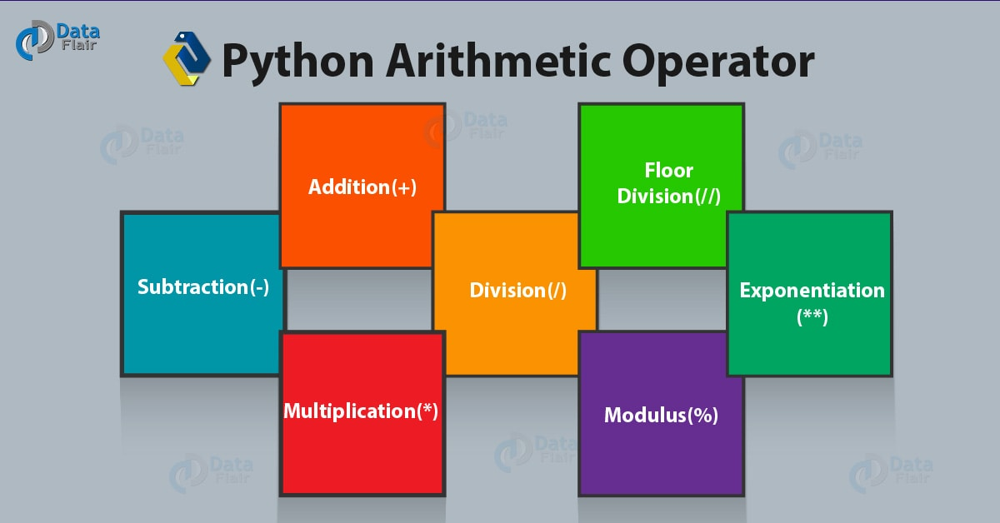

 # This note write some difference between `JS` with `Python` from a `JS` developer learning `Python`
## comment in code

(*) nice tutorial resource: [https://data-flair.training/blogs/python-tutorials-home/](https://data-flair.training/blogs/python-tutorials-home/)
  - js
  ``` js
  // this is single line comment
  
  /**
   * this is block of comment
   */
  ```
  - py
  ``` Python
  # this is single line comment
  
  """
   " this is block of comment
  """
  """this is docstring in function use in function define"""
  ```
## Data type
- Javascript has 7 basic types in JavaScript:

  + number
  + string
  + boolean [true, false]
  + null
  + undefined
  + object
  + symbol

  refer: [Javascript Info](https:/Jjavascript.info/types)

- Python has 5 standard Data Types:

  + Numbers
     
    - int.........a = 10...........Signed Integer
    - long........a = 345L.........(L) Long integers, they can also be represented in octal and hexadecimal
    - float.......a = 45.67........(.) Floating point real values
    - complex.....a = 3.14J........(J) Contains integer in the range 0 to 255.
    - use conversion functions (`int()`, `long()`, `float()`, `complex()`) to convert data from one type to another
  + String
  + List
    - like array in js(ex: `a = [1, 2 , 3]`)
      ``` python 
      mylist = ['Rhino', 'Grasshopper', 'Flamingo', 'Bongo']
      B = len(mylist) # This will return the length of the list which is 3. The index is 0, 1, 2, 3.
      print mylist[1] # This will return the value at index 1, which is 'Grasshopper'
      print mylist[0:2] # This will return the first 3 elements in the list.
      ```
    - dynamic and mutable
  + Tuple
    - like `list` but use parenthesis `()` instead of square bracket `[]` (ex: `a = (1, 2 , 3)`)
    - fixed size and immutable
  + Set
    - like `list` but use curly braces `{}` instead of square bracket `[]` (ex: `a = {1, 2 , 3}`)
    - dynamic, mutable and unique value
      ``` python
        lst = [1,2,2,3] # 1 list with duplicated with `2`
        st = set(lst)
        #or
        st = {1,2,2,3} 
        print st # -> set([1, 2, 3])
      ```
  + Dictionary
     - like json in js
        ``` python
        room_num = {'john': 425, 'tom': 212}
        room_num['john'] = 645  # set the value associated with the 'john' key to 645
        print (room_num['tom']) # print the value of the 'tom' key.
        room_num['isaac'] = 345 # Add a new key 'isaac' with the associated value
        print (room_num.keys()) # print out a list of keys in the dictionary
        print ('isaac' in room_num) # test to see if 'issac' is in the dictionary.  This returns true.
        ```

  refer: [rhino3d](https://developer.rhino3d.com/guides/rhinoPython/python-datatypes/)
## variable
  - js
  ``` js
  let a = 1
  const b = 2
  var c = 3
  ```
  - py
  ``` Python
  a = 1
  b = 2
  
  a, b, c = 1, 2, 3
  
  a, b, c = 4
  ...
  ```
  
## condition
  - js
  ``` js
  if(a){
  
  } else if(b){
  
  } else {
  
  }
  ```
  - py
  ``` Python
  if a:
  
  elif b:
  
  else:
  ```
  
## operator
  [Javascript Operator](https://developer.mozilla.org/en-US/docs/Web/JavaScript/Guide/Expressions_and_Operators/)
  
  [Python Operator](https://data-flair.training/blogs/python-operator/)
## ternary operator

- js
``` js
const a = b > 10 ? 10 : b
```
- py
``` python
#1. basic:
syntax: [on_true] if [expression] else [on_false]
a = 10 if b > 10 else b
#2. use tuple
syntax: [tuple][condition]
a,b = 1,2
c = (a,b)[a>b]
#3. use Dictionnaries
{False:f"b:{b}",True:f"a:{a}"}[a>b]
#4. use lambda
(lambda :f"b:{b}",lambda :f"a:{a}")[a>b]() # sooooooo complex
```
refer: [data-flair](https://data-flair.training/blogs/python-ternary-operator/)
  
## loop
  - js
  ``` js
  for(let i = 0; i < 10; i++){
    
  }
  for(let i in array){//i : index
  
  }
  for(let v of array){ // v : value
  }
  ...
  ```
  
  - py
  ``` Python
  for i in arr:
  
  ```
  
## code block
  - js use  `{}`
  ``` js
    if ( a > b ) {
      alert(a)//use new line character..
    } else {
      alert(b); // ..or `;` to end line
    }
  ```
  - py: use `space`
  ``` Python
   if a > b: 
      print a # use new line character
    else:
      print b
  
    # if want prevent new line break line use \ character like belove
    sum = 1 + 3 + 5 + \
      7 + 9 + 11 + \
      13 + 15 + 17
    
    #or
    message = """This is a string that will span across multiple lines. Using newline characters
and no spaces for the next lines. The end of lines within this string also count as a newline when printed"""  
  ```
   use space & new line to break 
  
## function
  - js
  ``` js
  function a(){}
  const a = function () {
    alert('anph');
  }
  const b = function () {
    alert('anph');
  }
  ```
  
  - py
  ``` Python
  def a():
    print 'anph'
  ```

  ## arrow | lambda
  - js

  ``` js
  const sum = (a, b) => a + b
  ```
  - py

  ```python
  sum = lambda a, b: a + b
  ```
## switch case
  - js
```js
  switch(x){
    case 1:
    break;
    case 2:
    break;
    case 3:
    break;
    ...
    default:
    break;
  }
```
  - py: python éo có, vâng python éo có switch case và phải tự chế -_-
```python
#1. kiểu truyền thống: use dictionary
  def week(i):
  switcher={0:'Sunday',1:'Monday',2:'Tuesday',3:'Wednesday',4:'Thursday',5:'Friday',6:'Saturday'}
  return switcher.get(i,"Invalid day of week")
#########
>>> week(2)
'Tuesday'
>>> week(0)
'Sunday'
>>> week(7)
'Invalid day of week'
>>> week(4.5)
'Invalid day of week'


#2. Using Python Functions & Lambdas
def zero():
  return 'zero'
def one():
  return 'one'
def indirect(i):
  switcher = { 0:zero, 1:one, 2:lambda:'two' }
  func = switcher.get(i,lambda :’Invalid’)
  return func()
>>> indirect(4)
‘Invalid’
>>> indirect(2)
'two'
>>> indirect(1)
'one'
>>> indirect(0.5)
'Invalid'


#3. With Python Classes
class Switcher(object):
  def indirect(self,i):
    method_name='number_'+str(i)
    method=getattr(self,method_name,lambda :'Invalid')
    return method()
def number_0(self):
  return 'zero'
def number_1(self):
  return 'one'
def number_2(self):
  return 'two'
##
>>> s=Switcher()
>>> s.indirect(2)
'two'
>>> s.indirect(4)
'Invalid'
>>> s.number_1()
'one'
````

## `map()`
- js
``` js
const numbers = [1,2,3,4,5,6,6,7,8,9,0]
const map0 = numbers.map(x=>x*2)
//->[2, 4, 6, 8, 10, 12, 12, 14, 16, 18, 0]
```
- py
``` python
numbers = [1,2,3,4,5,6,6,7,8,9,0]
map0 = list(map(lambda x:x*2, numbers))
#->[2, 4, 6, 8, 10, 12, 12, 14, 16, 18, 0]
```

## `filter()`
- js
``` js
const numbers = [1,2,3,4,5,6,6,7,8,9,0]
const filter0 = numbers.filter(x=>0===x%2)
//->[2, 4, 6, 6, 8, 0]
```
- py
``` python
numbers = [1,2,3,4,5,6,6,7,8,9,0]
map0 = list(map(lambda x:x*2, numbers))
#->[2, 4, 6, 8, 10, 12, 12, 14, 16, 18, 0]
```

## `reduce()`
- js
``` js
const numbers = [1,2,3,4,5,6,6,7,8,9,0]
const reduce0 = numbers.reduce((a,b)=>a+b)
//->51
```
- py
``` python
#map
numbers = [1,2,3,4,5,6,6,7,8,9,0]
reduce0 = reduce(lambda a,b: a+b, number)
#->51
```
  
## exception
 - `throw` | `raise`

    - js
    ``` js
    function a(e){
      if(e) throw 'e'
    }
    ```
    - py
    ``` python
    def a(e):
      if e
        raise Exception
    ```
- `try catch` | `try except`
    - js
    ``` js
    try{
    
    }catch(e){
      console.log(e)
    }
    ```
    - py
    ``` Python
    try:
    
    except:
      print sys.exc_info()[0]
    ```

## a bit bonus
  
 Feature | Javascript | Python |desc
-|-|-|-|-|-
 repeat string | '`str'.repeat(10)` | `'str' * 10` | o_0
 power number | `Math.pow(2, 3)` | `2 ** 3` | amazing
 sum array | `[1,2,3] + [4,5,6] => 1,2,34,5,6` | `[1,2,3] + [4,5,6] => [1, 2, 3, 4, 5, 6]` | amazing

 ## OOP
  
- js
``` js
/**
 * Đây là docstring. Một lớp mới vừa được khai báo.
 */
  class Anph extends ClassParent {//single extend
    constructor(){

    }
    //more code
  }
  //use
  const anph = new Anph()
```
- py
``` python
 class Anph(ClassParent, ClassParent2):# multi-extends able
  '''Đây là docstring. Một lớp mới vừa được khai báo.'''
  def __init__():
    
  #more code

#use
anph = Anph()
```