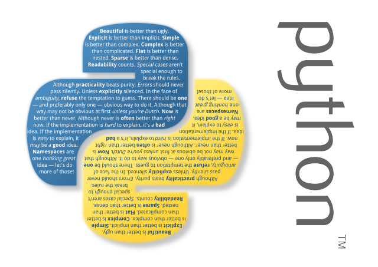

## reverse string
``` py
a =  'string'
print ("Reverse is", a[::-1])
#>Reverse is gnirts
```

## cast list value for each variable
``` py
a = [1, 2, 3]
x, y, z = a
print(x, y, z)
#>1, 2, 3
```
## Join list
``` py
a = ["Code", "Python", "Developer"]
> print " ".join(a)
#>Code Python Developer
```
## loop 2 list in 1 for command
``` py
list1 = ['a', 'b', 'c', 'd']
list2 = ['p', 'q', 'r', 's']
for x, y in zip(list1,list2):
  print x, y

#a p
#b q
#c r
#d s
```
## swap variable 1 line
``` py
a=7
b=5
b, a = a, b
print(a, b)
#>5, 7
```
js can do follow this style:
``` js
var a = 5, b= 7
[b, a] = [a, b]
console.log(a, b)// 5 7
```
## Repeat string
``` py
print('code'*4+' '+'mentor'*5)
#>codecodecodecode mentormentormentormentormentor
```
## Convert 2D list -> 1D list not loop
``` py
a = [[1, 2], [3, 4], [5, 6]]
import itertools
print(list(itertools.chain.from_iterable(a)))
#>[1, 2, 3, 4, 5, 6]
```
## Cast input to list
```py
> result = map(lambda x:int(x) ,raw_input().split())
1 2 3 4
> result
[1, 2, 3, 4]

```
## cast string to list number use `map`
``` py
s = '1 2 3 4'
result = map(int, s.split())
print(result)
#> [1, 2, 3, 4]
```