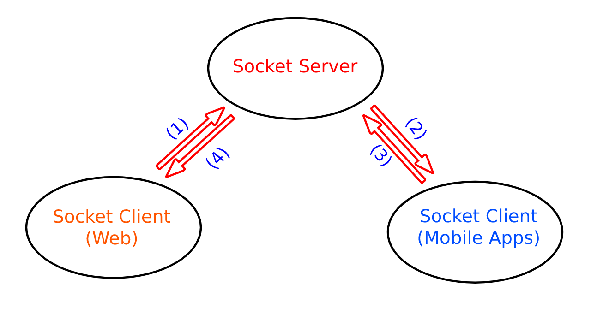
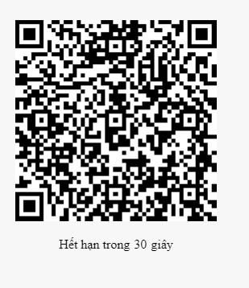

Mến chào các đồng code,
Mình đặt title có hơi quá tay tý mọi người thông cảm, vì không làm vậy bạn chắc gì đang đọc dòng này.. nhỉ?

Vừa rồi mình nhận được đề nghị của boss trang Anonystick chia sẻ về kỹ thuật login QR code nên mình mạo muội viết ít dòng, có gì sai sót mong quý bạn và các vị góp ý! Xin chân thành cảm ơn! Không để phí thời gian quý báu của các bạn, mình vào luôn chủ đề hôm nay nhé! Dzô..


Concept cơ bản của kỹ thuật này sẽ nằm gọn trong hình sau


Như bạn đã thấy, ở đây mình dùng SocketIO server để làm trung gian cho 2 client là Web và App theo thứ tự mình đánh số trong hình. Mình sẽ giải thích cặn kẽ kèm theo code cho từng bước ngay sau đây.

1. User vào trang `/login` của ứng dụng
HTML dùng hiển thị:
``` html
<div class="login-panel">
  <div class="code-panel">
  <!--QR code sẽ được tạo ra và hiện ở đây-->
    <div id="qrcode" class="code-view"></div>
    <!--lớp che và nút làm mới khi QR hết hạn-->
    <div class="qrcode-mask show">
        <p>QR code hết hạn!</p>
        <button class="btn" id="f5Btn">refresh</button>
    </div>
    <div id="expire_qr" class="expire-countdown">
        Hết hạn trong<span>30</span>giây
    </div>
</div>
```
sau đó thêm 1 ít css cho nhìn thuận mắt:
``` css
.login-panel{width:100vw;}
.code-panel{position:relative;width:250px;height:130px;margin:0 auto;}
.code-view{width:100%}
.code-view img{width:100%;height:auto}
.qrcode-mask{display:none;position:absolute;width:100%;height:100%;top:0;left:0;background:rgba(255,255,255,.7);padding:25% 0;display:none}
.qrcode-mask p{text-align:center;display: inline-block;width:100%;color:#00f;font-size:20px}
.qrcode-mask button{margin:0 auto;display: block}
.qrcode-mask.show{display:block}
.expire-countdown{width:100%;text-align:center;margin:20px 0}
.expire-countdown span{margin:0 5px}
```



Có 2 thành phần trên GUI trông sẽ như thế này. Bây giờ chúng ta bắt đầu vào phần JS xử lý, mình sẽ trình bày theo mạch code nên đôi khi hơi rối mạch suy nghĩ, bạn cố gắng xoắn não tý cho vui nhé:

Đầu tiên `window.onload` gọi `refreshToken()`: hàm này là nguồn cơn mọi vấn đề
```js
var socket;
window.onload = function () {
  refreshToken();
}
```
..và thêm sẵn event click refresh gọi hàm này luôn, 1 công đôi việc

```js
_q(#f5Btn').addEventlistener(function () { 
  refreshToken();
});
  ```
`refreshToken()` chỉ có nhiệm vụ mở kết nối tới socket server và đăng ký sự kiện `socket on connect`
```js
function refreshToken() {
  socket = io.connect('localhost', { 'forceNew': true });
  socket.on('connect', socketConnect);
}
```
Hàm `socketConnect()` để nhận và xử lý sự kiện `socket on connect` ở trên mình có chú thích trong từng dòng nên không nói thêm nha
``` js
function socketConnect() {
  // 1. Dùng socket id của web kèm theo thông tin browser gói thành 1 chuỗi
  var token = createToken();
  $('#qrcode').html('');
  // 2. Dùng thư viện tạo QR code đưa vào div#qrcode, size 200x200
  var qrcode = new QRCode(document.getElementById("qrcode"), { width: 200, height: 200 });
  // 3. Tạo QR code từ token ở trên
  qrcode.makeCode(token);
  // 4. Hiện mask lên đầu tiên
  _q('.qrcode-mask').classList.remove('show');
  _q('.code-view').classList.remove('disable');
  _q('#expire_qr').classList.add('show');
  // 5. đẩy token lên server socket để đăng ký room đây là điểm mấu chốt đưa ta đến bước 2
  socket.emit('webClientJoin', { token });
  // 6. gọi countdown 
  countDown();
}
```
Hàm tạo token để gửi lên socket server theo format `<socketid>@<bonus info>`
`getBrowserInfo()`: mình dùng để lấy thông tin browser client, các bạn có thể tự viết theo cách của mình.

```js
function createToken() {
  var bInfo = getBrowserInfo()
    , token = [
      socket.id,
      bInfo.OSName + ' - ' + bInfo.browserName + '/' + bInfo.majorVersion
    ].join('@')
  return b64EncodeUnicode(token);
}
```
Hàm `countDown()` dùng đếm ngược thời gian hết hạn, mục đích của việc Giới hạn thời gian mở room 30s  nhằm để:

  - Tránh lãng phí tài nguyên khi kết nối liên tục
  - Không dùng lại QR nhằm tăng tính bảo mật
  - và để cho ngầu nữa ahihi
  
```js
function countdown() {
  var count = 30
  , intervalQR = setInterval(function () {
    _q('#expire_qr>span').innerHTML = --count
    if (0 === count) {
      _q('.qrcode-mask').classList.add('show');
      _q('.code-view').classList.add('disable');
      _q('#expire_qr').classList.remove('show');
      socket.disconnect();
      clearInterval(intervalQR);
    }
  }, 1000);
}
```

2. Sau đây là phần code socket ở server, ở đây có 4 event tất cả, tạm thời để ở đây  mình sẽ có hàm xử lý và giải thích theo từng event.

```js
const io = require('socket.io').listen(app);
io.sockets.on('connection', function(socket) {

  socket.on('webClientJoin', function(data, callback) {
    webClientJoin(socket, data, callback);
  });

  socket.on('webClientLeave', function(data) {
    webClientLeave(socket, data);
  });

  socket.on('appClientJoin', function(data, callback) {
    appClientJoin(socket, data, callback);
  });

  socket.on('appClientConfirm', function(data, callback) {
    appClientConfirm(socket, data, callback);
  });
});
```

2. User mở App scan QR code được tạo và hiển thị ở bước 1

Hiện tại trên Thế giới thịnh hành 2 OS mobile iOS và Android, nhưng để tiện và dễ hiểu trong ví dụ này mình sẽ giả lập client App bằng JS luôn để bạn dễ hình dung và thử nhé.
Văn vở vậy đủ rồi, vấn đề chính mình không biết làm app ahihi

Theo yêu cầu của bài viết là làm rõ login với QR code, cho nên chúng ta giả định app đã login thành công đang giữ `token` và ở bước này chúng ta sẽ dùng token đó giúp Web login vào user tương ứng bằng 2 biến trong session app: `token`, `usrname`

```js
window.onload = function () {
$(document).on("click", "#login", function () {
  var socket = io.connect('localhost');
})
```

```js
socket.emit("appClientJoin", { token: tokenInput.value }, function (rs) {
  if ("success" !== rs.status){
    alert(JSON.stringify(rs))
    return;
  }
  if(!confirm("Are you sure allow: " + rs.body + " login your account?"))
    alert("Access denied!")
    else
      socket.emit("appClientConfirm", {
      usrname,
      token
      }, function (n) {
        alert(JSON.stringify(n)) 
      });
  });
};
```

3. Socket server trả về client login thành công
4. 


Bonus một số hàm util dùng trong bài:
``` js
  // Hàm này để rút gọn `querySelector`
  var _q = document.querySelector.bind(document);

  // Mã hóa Base64
  function b64EncodeUnicode(str) {
    return btoa(encodeURIComponent(str).replace(/%([0-9A-F]{2})/g, function (match, p1) {
      return String.fromCharCode('0x' + p1);
    }));
  }

  // Giải mã Base64
  function b64DecodeUnicode(str) {
    return decodeURIComponent(Array.prototype.map.call(atob(str), function (c) {
      return '%' + ('00' + c.charCodeAt(0).toString(16)).slice(-2);
    }).join(''));
  }
```

Lưu ý: trong bài này mình chỉ đề cập về kỹ thuật và bỏ qua các bước bảo mật cho code dễ nhìn, khi đi vào thực tế từng request các bạn phải verify theo cách của mình để hệ thống được an toàn hơn.

Mong là những gì mình vừa trình bày có thể giúp bạn thỏa mãn phần nhỏ trong quá trình tìm tòi và tò mò về mọi thứ trên đời.

Chúc bạn thành công!

Anph